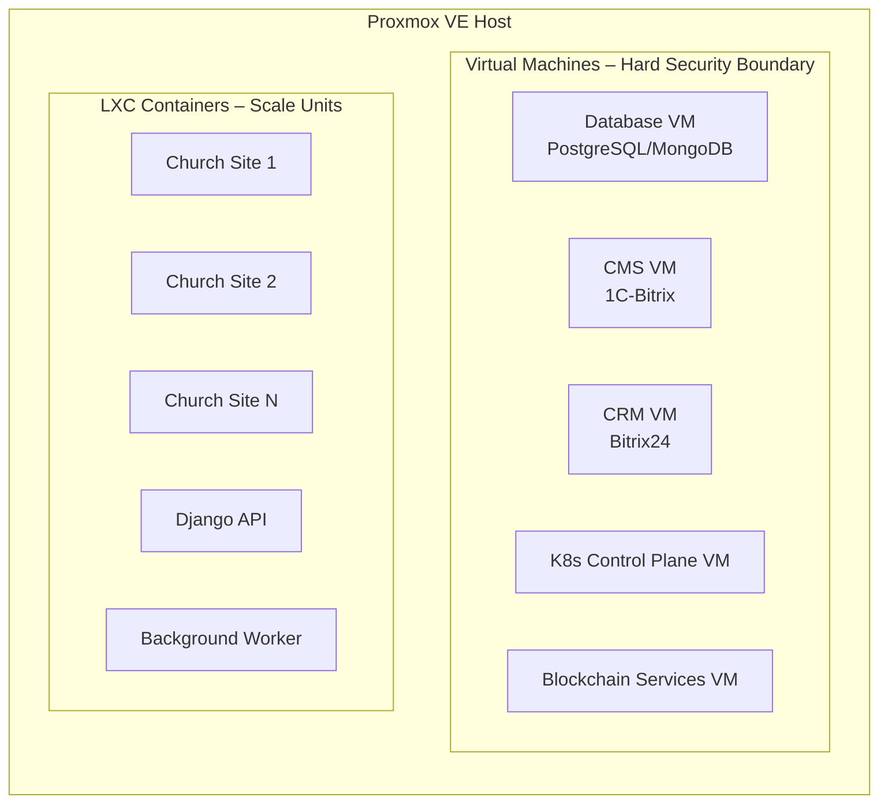
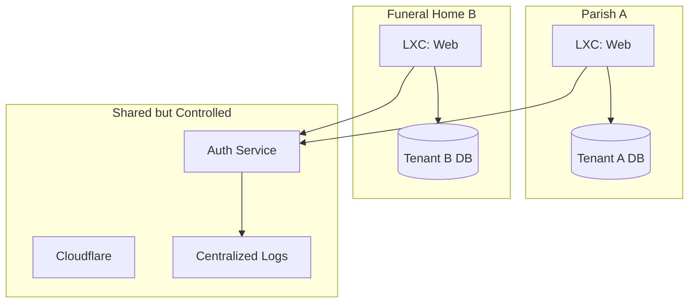
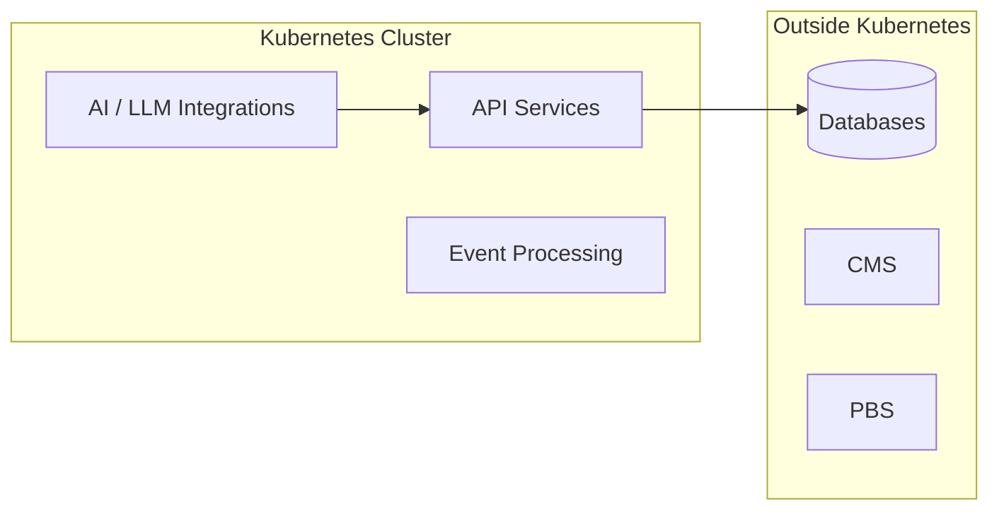
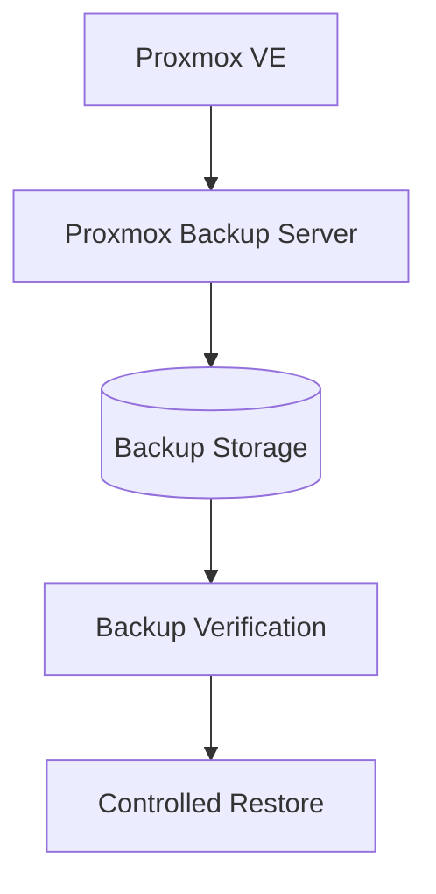
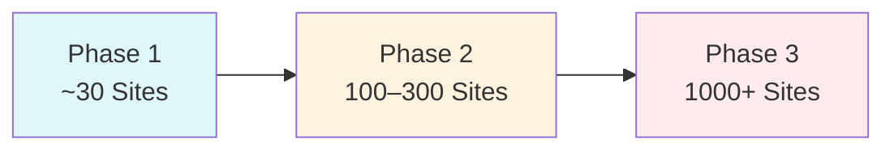
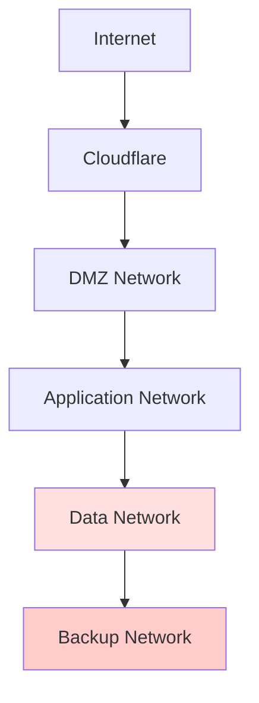

Below are **architecture diagrams suitable for direct inclusion in a GitHub README**, written and structured from a **paranoid, compliance-driven architect’s perspective**.

They use **Mermaid**, which is natively supported by GitHub and avoids external tooling, screenshots, or undocumented dependencies.

You can paste these **as-is** into your `README.md` or `/docs/architecture.md`.

---

## 1️⃣ High-Level System Architecture (Investor / Auditor View)

```mermaid
flowchart TB
    Internet((Internet))
    Cloudflare[Cloudflare\nDDoS • CDN • WAF]
    Domain[gyvenimo-kelias.lt\n~1000 subdomains]

    Internet --> Cloudflare --> Domain

    Domain --> ProxmoxVE[Proxmox VE 9.1\nPhysical Cluster]

    ProxmoxVE --> Frontend[Next.js SSR\nMaster Website]
    ProxmoxVE --> Tenants[Multi-Tenant Websites\n(LXC Containers)]
    ProxmoxVE --> K8s[Kubernetes Cluster\n(kubeadm)]
    ProxmoxVE --> CoreVMs[Core Service VMs]

    CoreVMs --> Databases[(PostgreSQL\nMongoDB)]
    CoreVMs --> CMS[1C-Bitrix CMS]
    CoreVMs --> CRM[Bitrix24 CRM]

    K8s --> APIs[Stateless APIs\nAI • Integrations]

    ProxmoxVE --> PBS[Proxmox Backup Server 4.1]

    PBS --> Backups[(Immutable Backups)]
```

### **Key Compliance Notes**

* No direct internet access to databases
* All inbound traffic filtered via Cloudflare
* Backup system is isolated and immutable

---

## 2️⃣ Proxmox VE Workload Isolation Model (Security-Critical)



### **Architectural Rule**

> *Anything containing irreplaceable state or compliance risk runs in a VM.*

---

## 3️⃣ Multi-Tenant Website Architecture (Isolation by Design)



### **Compliance Guarantees**

* No cross-tenant database access
* No shared credentials
* Tenant data deletion is deterministic and auditable

---

## 4️⃣ Kubernetes Responsibility Boundary (No “K8s Everywhere”)



### **Hard Rule**

> *Kubernetes does not own state.*

---

## 5️⃣ Backup & Disaster Recovery Architecture (Ransomware-Resistant)



### **Design Assumptions**

* Backups must survive:

  * Admin error
  * Malware
  * Insider threat
* Restore is **slower but guaranteed**

---

## 6️⃣ Scaling Model: 30 → 1000 Sites



### **Scaling Strategy**

* Horizontal first
* Automation before expansion
* No architectural changes between phases

---

## 7️⃣ Trust & Network Segmentation Model (Zero Trust)



### **Security Policy**

* Each network has explicit allow rules
* No lateral movement by default
* Backup network is write-only from Proxmox

---

## ✅ How to Organize These in the Repo

Recommended structure:

```text
/docs
  architecture.md   ← diagrams + explanations
  security.md
  compliance.md
  scaling.md
```

---

## Next Professional Steps (Recommended)

I can now:

1. **Add a threat model (STRIDE-based)**
2. **Create a tenant lifecycle diagram**
3. **Produce a Proxmox network VLAN design**
4. **Add an investor-friendly simplified diagram**
5. **Generate an ISO/VM/LXC build matrix**

State the next step explicitly.
